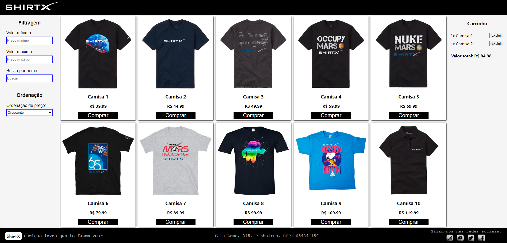

# `Projeto`
E-commerce ShirtX

# `Link`
[Clique aqui!](https://shirtx-alves.surge.sh/)

# `Descrição`
O Projeto LabEcommerce foi desenvolvido como uma atividade do dentro do curso Full-Stack Web Developer da Labenu, o qual consiste em um E-commerce de vendas de camisas e camisetas com a temática de astronomia, com as opções de filtragem por valor mínimo e máximo, além de filtragem por nome. O site possui também a opção de adicionar produtos ao carrinho de compras, onde é possível excluir os itens e também é apresentado o valor total destes.

# `Modo de usar`
No lado esquerdo o usuário pode filtrar os produtos por preço mínimo, preço máximo e também buscar por nome. Existe também a opção de ordenar os produtos por ordem crescente ou decrescente de preço.
 
Ao clicar em "Comprar" o usuário automaticamente adiciona o produto ao carrinho. O usuário pode adicionar quantos produtos quiser.
 
Na parte direita da tela está o carrinho, que possui as informações dos produtos que estão adicionados e também o valor total da compra. O usuário também tem a opção de excluir os produtos do carrinho.
 
Na parte inferior está o rodapé, que possui algumas informações, inclusive ícones clicáveis das redes.

# `Instalando e rodando o projeto`
Fazer o clone do projeto:
- git clone link-do-repositório

Instalar as dependências:
- npm install

Rodar o projeto:
- npm run start

# `Tecnologias utilizadas`

# `Autores`

Evandro Paulo Folletto
 
  
 

Márleo Piber da Rosa
 
 
 

Olavo Marques do Nascimento
 
 

# `Imagens`
### Página Login

